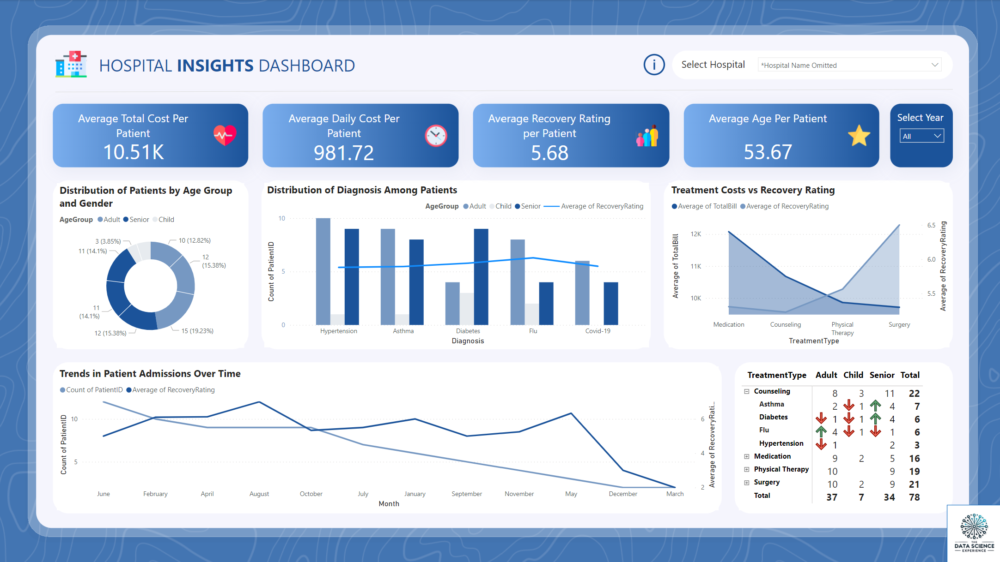

# Healthcare Insights Dashboard using Power BI

## Executive Summary
This project uses Power BI to analyze hospital data, focusing on patient demographics, treatment outcomes, and costs for 1000 patients and 5 hospitals. The dashboard reveals key insights, such as optimizing treatment costs by focusing on high-recovery, cost-effective treatments and tailoring care based on patient age and gender. These insights support better decision-making, improving both patient outcomes and hospital efficiency.

## Tools and Skills
- **Power BI**: Developed dynamic visualizations and an interactive dashboard.
- **Data Analysis**: Performed in-depth analysis of hospital and patient data to derive meaningful insights.
- **Statistical Analysis**: Applied statistical methods to uncover trends and correlations in the data.
- **Healthcare Domain Expertise**: Interpreted analytical results with a strong understanding of healthcare operations and patient care.

## Dataset
This project utilizes two Excel sheets containing data for 1000 patients and 5 hospitals. The dataset includes:

1. **Patient Information**
- Patient: Unique identifier
- PatientName: Full name
- Age: Age at admission
- Gender: Gender
- Bloodtype: Blood type
- Diagnosis: Primary diagnosis
- Treatment: Administered treatment(s)
- AdmissionDate: Admission date
- DischargeDate: Discharge date
- TotalBill: Total cost of stay
- Full Prescription Details: Medication details
2. **Hospital and Staff Information**
- Patient: Unique identifier
- Hospital: Name of hospital
- DoctorName: Attending doctor
- RoomNumber: Room number
- DailyCost: Daily cost of stay
- Treatment: Administered treatment(s)
- RecoveryRating: Patient's recovery rating

This dataset provides key insights into patient care, hospital operations, and financial data.

## Business Question
**"How can the hospital optimize treatment costs while maintaining or improving patient recovery outcomes across different age groups and treatment types?"**

## Key Insights and Recommendations
1. **Cost Analysis Across Treatment Types:**
- **Observation:** Surgery incurs the highest average costs per patient.
- **Actionable Insight:** Consider alternative treatments like physical therapy or medication for applicable conditions, as these may reduce costs while maintaining effectiveness.

2. **Treatment Costs vs. Recovery Rating:**
- **Observation:** Surgery, while expensive, does not always correlate with the highest recovery ratings.
- **Actionable Insight:** Increase focus on treatments such as counseling, which demonstrate high recovery ratings and lower costs, to optimize both patient outcomes and financial efficiency.

3. **Age Group Analysis:**
- **Observation:** Recovery rating variability is highest among seniors, indicating that different age groups respond differently to treatments.
- **Actionable Insight:** Tailor treatment plans based on age-specific recovery data to allocate resources more effectively and improve outcomes across all age groups.

4. **Trends in Patient Admissions Over Time:**
- **Observation:** Peak admission months correlate with specific diagnoses.
- **Actionable Insight:** Use admission trends to better manage resources during high-demand periods, optimizing both patient care and operational efficiency.

## Stakeholder Recommended Next Steps by Priority

### High Priority

**1. Optimize Treatment Plans Based on Recovery Ratings and Costs**
- **Action:** Increase focus on cost-effective treatments with high recovery ratings to enhance both patient outcomes and financial efficiency.
- **Specific Steps:**
  - Prioritize treatments such as counseling over surgery where applicable, as counseling shows high recovery ratings at a lower cost.
  - Conduct a comprehensive review of current treatment protocols to identify opportunities for substituting high-cost, low-recovery treatments with more effective alternatives like physical therapy or medication.

**2. Tailor Treatment Plans for Seniors Based on Age-Specific Data**
- **Action:** Develop age-specific treatment plans to improve recovery outcomes, particularly for seniors who show the highest variability in recovery ratings.
- **Specific Steps:**
  - Analyze recovery data segmented by age group to identify the most effective treatments for seniors.
  - Implement targeted interventions for senior patients, adjusting treatment protocols to better align with age-related recovery patterns.

### Medium Priority

**3. Use Admission Trends to Optimize Resource Allocation**
- **Action:** Leverage patient admission trends to improve resource management during peak periods, ensuring optimal patient care and operational efficiency.
- **Specific Steps:**
  - Monitor admission data to identify months with peak admissions for specific diagnoses.
  - Adjust staffing levels, bed availability, and supply inventory in anticipation of these high-demand periods to prevent resource shortages.

### Low Priority

**4. Explore Alternative Treatments to Surgery**
- **Action:** Consider alternative, less expensive treatments like physical therapy or medication for conditions where surgery is currently used but may not be the most cost-effective option.
- **Specific Steps:**
  - Pilot alternative treatment programs for conditions typically treated with surgery, comparing outcomes and costs to existing protocols.
  - Gather data from these pilots to inform broader adoption of more cost-effective treatment strategies across the hospital.

## Dashboard Screenshot

